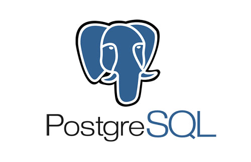

# SQL Queries e Exercícios

Este repositório contém práticas, exercícios e projetos relacionados ao aprendizado de SQL. Cada pasta dentro do repositório é dedicado a um tópico ou projeto, com scripts SQL e descrições detalhadas.

## Estrutura do Repositório

- /farmacia: Projeto de Banco de Dados para gerenciamento de uma farmácia, com mini-mundo, MER, DER e consultas SQL específicas.

## Projeto Farmácia

Este projeto consiste na modelagem do banco de dados para gerenciamento de uma farmácia usando SQL. O objetivo é praticar do mini-mundo até a criação do banco de dados. Este projeto foi realizado na faculdade na matéria Projeto de Banco de Dados.

### Mini-mundo

O objetivo do mini-mundo em um banco de dados é definir o contexto ou ambiente específico para o qual o banco de dados será projetado.

Neste case:

Uma farmácia deseja guardar dados do estabelecimento, a farmácia é composta por vários produtos que possui nome, preço, tarja, quantidade e data de validade e também quer registrar informações dos pedidos de cada cliente que são cadastrados no sistema com nome, cpf, endereço, número de celular e data de cadastro. No pedido registra-se: produtos, quantidade, formas de pagamento, valor total e data da compra. Cada venda é feita por um funcionário que é cadastrado no sistema com nome, cpf, endereço, número de celular e data de admissão.

### MER

O Modelo Entidade Relacionamento (MER) em um banco de dados tem o objetivo de descrever os objetos do mundo real, seus atributos e relacionamentos, para criar adequadamente as entidades e seus relacionamentos.

Neste case:

- Produtos:
    (nome, preço, tarja, quantidade e data de validade)
- Cliente:
    (nome, cpf, endereço, número de celular e data de cadastro)
- Funcionário:
    (nome, cpf, endereço, número de celular e data de admissão)
- Pedidos:
    (produtos, cliente, funcionário, quantidade, formas de pagamento, valor unitário e data de compra)

### Relacionamentos:
O objetivo do Relacionamentos em um banco de dados é representar as interações e associações entre as entidades, refletidas nas conexões lógicas entre elas no mundo real.

Neste case:
Cliente faz um pedido, um pedido possui produtos e o funcionário autoriza/executa o pedido.

### Cardinalidade:
O objetivo da cardinalidade em banco de dados é definir o relacionamento entre as entidades ou tabelas, indicando quantas instâncias de uma entidade se relacionam com quantas instâncias de outra.

Neste case:
Um cliente pode fazer um ou mais pedidos
Um funcionário autoriza/executa um ou mais pedidos
Um pedido pode ter um ou mais produtos

### DER
O objetivo do Diagrama Entidade Relacionamento é fornecer uma maneira clara e concisa de entender a estrutura de um banco de dados.

Neste case:

### CREATE TABLES
Após todo o processo de modelagem, as tabelas do banco de dados foram criadas usando SQL. Script de criação das tabelas: [create-tables.sql](./farmacia/create-tables.sql)

### Ferramentas:

- SDBG: PostgreSQL 17
- IDE/Editor: DBeaver
- Diagramação: LucidChart

  

Em breve mais projetos!

Contatos:
- [Email](mailto:j.marcoscor04@gmail.com)
- [LinkedIn](https://www.linkedin.com/in/jeanmarcoscor)
